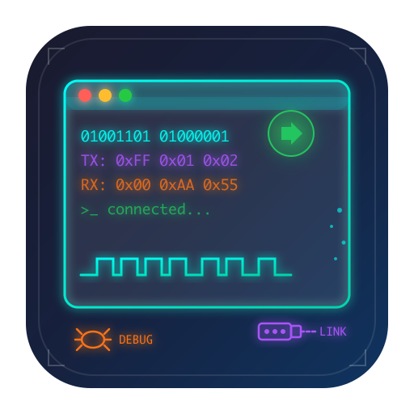

# SerialMate

<p align="center">
  
</p>

<p align="center">
  <strong>一款现代化的跨平台串口调试工具</strong>
</p>

<p align="center">
  🤖 本项目 99% 的代码由 AI 完成
</p>

<p align="center">
  <a href="#功能特性">功能特性</a> •
  <a href="#截图预览">截图预览</a> •
  <a href="#下载安装">下载安装</a> •
  <a href="#开发指南">开发指南</a>
</p>

---

## 功能特性

- 🔌 **多种连接方式**
  - 串口通信 (Serial Port)
  - TCP 客户端 (TCP Client)
  - TCP 服务器 (TCP Server)
  - UDP 通信

- 📊 **数据收发**
  - 支持 HEX / ASCII 显示模式
  - 支持多种字符编码 (UTF-8, GB2312, GBK, Big5, ASCII)
  - 支持多种换行符 (CRLF, CR, LF)
  - 定时自动发送功能
  - 收发统计

- 🎨 **现代化界面**
  - 简洁直观的用户界面
  - 时间戳显示
  - 自动滚动
  - 数据导出

- 💻 **跨平台支持**
  - Windows (x64, x86)
  - macOS (Intel, Apple Silicon)
  - Linux

## 截图预览


## 下载安装

### 从 Release 下载

前往 [Releases](../../releases) 页面下载适合您系统的安装包：

| 平台 | 架构 | 下载 |
|------|------|------|
| Windows | x64 | `serialmate_x.x.x_x64-setup.exe` |
| Windows | x86 | `serialmate_x.x.x_x86-setup.exe` |
| macOS | Intel | `serialmate_x.x.x_x64.dmg` |
| macOS | Apple Silicon | `serialmate_x.x.x_aarch64.dmg` |

Apple Silicon 机型请下载 `aarch64` / `arm64` 包，不要安装 `x64` 的 Intel 版本。
如果 macOS 提示应用无法打开、已损坏或需要移到废纸篓，通常不是程序本体坏了，而是安装包没有完成 Apple 开发者签名和公证。

### 从源码构建

请参考下方 [开发指南](#开发指南)。

## 开发指南

### 环境要求

- [Node.js](https://nodejs.org/) >= 20
- [pnpm](https://pnpm.io/) >= 9
- [Rust](https://www.rust-lang.org/) (stable)
- [Tauri CLI](https://tauri.app/)

### 推荐 IDE 配置

[VS Code](https://code.visualstudio.com/) + [Svelte](https://marketplace.visualstudio.com/items?itemName=svelte.svelte-vscode) + [Tauri](https://marketplace.visualstudio.com/items?itemName=tauri-apps.tauri-vscode) + [rust-analyzer](https://marketplace.visualstudio.com/items?itemName=rust-lang.rust-analyzer)

### 安装依赖

```bash
pnpm install
```

### 开发模式

```bash
pnpm tauri dev
```

### 构建发布版本

```bash
pnpm tauri build
```

## 技术栈

- **前端**: [SvelteKit](https://kit.svelte.dev/) + [TypeScript](https://www.typescriptlang.org/)
- **后端**: [Tauri](https://tauri.app/) + [Rust](https://www.rust-lang.org/)
- **构建工具**: [Vite](https://vitejs.dev/)

## 许可证

MIT License
